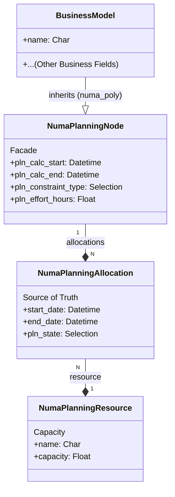

# Numa Planning: High-Performance APS Framework for Odoo 18

## Introduction & Philosophy

`numa_planning` is a headless, abstract engine designed to bring **Advanced Planning and Scheduling (APS)** capabilities to any Odoo model. Unlike traditional planning modules that are tightly coupled to specific business objects (like Project Tasks or Manufacturing Orders), `numa_planning` introduces a **Separation of Concerns** through a "Shadow Structure".

### Core Architectural Shift

*   **Business Logic:** Stays within your inheriting model (e.g., `project.task`, `mrp.production`, or even `maintenance.request`).
*   **Time & Capacity Logic:** Offloaded to `numa.planning.node` (acting as a Facade) and `numa.planning.allocation` (the Source of Truth).

This decoupling allows you to manage complex scheduling constraints, multiple resource allocations, and "What-If" scenarios without polluting your primary business tables with transient planning data.

### Architecture Diagram



---

## Integration Guide

### Step 1: Inheritance with `numa_poly`

To make any model "Planable", you must inherit from `numa.planning.node` using the `numa_poly` polymorphic engine.

```python
from odoo import models, fields

class MyBusinessObject(models.Model):
    _name = 'my.business.object'
    _inherit = ['numa.planning.node'] # numa_poly handles the polymorphic link automatically
    
    name = fields.Char('Title')
    # ... your logic
```

### Step 2: Strict Naming Convention

> **WARNING: THE `pln_` PREFIX RULE**
> 
> All fields and methods provided by the planning engine use the `pln_` prefix. When extending or overriding planning logic, you **MUST** respect this convention to prevent collisions with standard Odoo fields (e.g., Odoo's native `state` vs. our `pln_state`).

### Step 3: View Integration

Inject the "Planning Engine" tab into your business object's form view to gain full APS visibility with zero additional UI code.

```xml
<record id="my_business_object_view_form" model="ir.ui.view">
    <field name="model">my.business.object</field>
    <field name="inherit_id" ref="numa_planning.view_numa_planning_node_form_mixin"/>
    <field name="arch" type="xml">
        <xpath expr="//page[@name='planning_engine']" position="attributes">
            <attribute name="invisible">0</attribute>
        </xpath>
    </field>
</record>
```

---

## Core Concepts

### Nodes vs. Allocations

*   **Planning Node (The Job):** Defines the requirements. It holds the duration type, effort hours, and scheduling constraints (ASAP, ALAP, Fixed Dates).
*   **Planning Allocation (The Schedule):** Represents the actual booking of a resource in a specific time slot. A single Node can have multiple Allocations (e.g., a 20-hour task split between two engineers).

### The 5 Scopes of Reality (Lifecycle States)

The engine supports various lifecycle states to manage the planning timeline:

1.  **Baseline:** The "Frozen Contract". Used for variance analysis.
2.  **History:** The "Immutable Past". Actuals reported from the field.
3.  **WIP (Work in Progress):** The "Active Anchor". Current execution status.
4.  **Planning (Official):** The "Committed Future". The plan everyone is working towards.
5.  **Scenarios:** The "Sandbox". Used for What-If simulations without affecting the Official Plan.

### The Availability Ledger

Resources (`numa.planning.resource`) do not just follow a simple recurring calendar. They use an **Availability Ledger** (`numa.planning.availability.period`) that flattens recurring rules and handles exceptions:
*   **Priorities:** Maintenance (Priority 10) automatically overrides a Standard Shift (Priority 1).
*   **Efficiency:** Multipliers for reduced capacity (e.g., a machine running at 50% speed).

---

## Developer API Reference

### Key Methods to Know

*   **`_compute_pln_dates()`**: Aggregates dates from the Official Scenario allocations. Override this if you need custom aggregation logic.
*   **`_inverse_pln_dates()`**: Handles manual UI adjustments (like dragging a task in a Gantt chart). It automatically shifts or resizes underlying allocations.
*   **`pln_action_auto_schedule()`**: The entry point for the scheduling engine. It triggers both CPM calculations and Resource Leveling (Clipping).
*   **`action_pln_resource_leveling()`**: Executes the greedy resource leveling algorithm to resolve capacity conflicts.
*   **`resource.get_capability_at(timestamp)`**: Queries the Availability Ledger to find the effective efficiency of a resource at a specific moment, considering overlaps and priorities.

---

## Testing & Validation

The module includes a robust test suite that validates the core APS math and polymorphic integrity.

### Running Tests

```bash
odoo-bin -i numa_planning --test-enable
```

> **DX Tip:** Because `numa.planning.node` is a concrete model in the polymorphic hierarchy, you can run tests directly against it or against your concrete inheriting models. The existing test suite in `numa_planning/tests/` serves as living documentation for the expected behavior of the engine.

## Visual Frontend: Numa Gantt View

`numa_planning` includes a custom, high-performance Gantt view designed to handle large-scale planning data.

### Key Features
- **Hybrid Rendering:** Uses standard DOM for the WBS (Left Pane) and HTML5 Canvas for the Timeline (Right Pane).
- **Infinite Scrolling:** Smoothly handle thousands of nodes without performance degradation.
- **Drag & Drop:** Interactively reschedule tasks by dragging bars on the canvas.
- **Resource Histogram:** Integrated heatmap showing resource load at the bottom of the timeline.

### How to use
In your Odoo XML architecture, simply use the `<numa_gantt>` tag:

```xml
<record id="my_business_object_gantt" model="ir.ui.view">
    <field name="model">my.business.object</field>
    <field name="arch" type="xml">
        <numa_gantt date_start="pln_calc_start" date_stop="pln_calc_end">
            <!-- WBS columns can be customized here in future versions -->
        </numa_gantt>
    </field>
</record>
```
